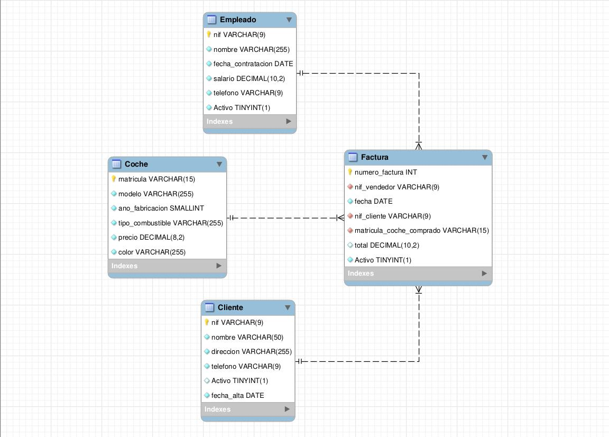

# Documentación Examen PHP

[//]: # "version: 1.0"
[//]: # "author: Manuel Ibáñez"
[//]: # "date: 2024-01-22"

## 1. Introducción

En este documento se va a explicar el funcionamiento de la aplicación web que se ha desarrollado para el examen de PHP.

## 2. Descripción de la aplicación

La aplicación web que se ha desarrollado para el examen de PHP es una aplicación que permite gestionar una base de datos de usuarios. Para ello, se ha desarrollado una aplicación web que permite realizar las siguientes acciones:

- Listar los clientes de la base de datos.
- Añadir un clientes a la base de datos.
- Modificar un clientes de la base de datos.
- Eliminar un clientes de la base de datos.
- Recuperar un clientes eliminado de la base de datos.

Pero no solo es para los clientes, tambien es para las facturas, para poder listarlas, añadirlas, eliminarlas. Tambien es para los empleados y para los coches.

Tambien dispone de un sistema de login para poder acceder a la aplicación.

## 3. Descripción de la base de datos

La base de datos que se ha utilizado para el desarrollo de la aplicación web es la siguiente:

## 4. Tecnologías utilizadas

Para el desarrollo de la aplicación web se han utilizado las siguientes tecnologías:

- PHP: Lenguaje de programación utilizado para el desarrollo de la aplicación web.
- MySQL: Sistema de gestión de bases de datos utilizado para el desarrollo de la aplicación web.
- HTML: Lenguaje de marcado utilizado para el desarrollo de la aplicación web.
- CSS: Lenguaje de diseño utilizado para el desarrollo de la aplicación web.
- Bootstrap: Framework utilizado para el desarrollo de la aplicación web.
- ion-icon: Para los iconos de la aplicación web.
